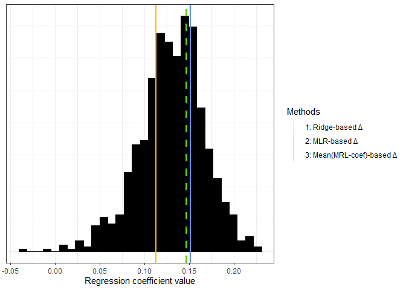

Comparing cross-sectional biological age prediction approaches with
naive approaches approaches
================
Marije Sluiskes

This document contains the code I used for the real data analysis as
provided in our paper
(<https://www.biorxiv.org/content/10.1101/2023.01.01.522413v1>). The
paper contains more details on the following analyses.

# Set-up

``` r
# load libraries
library(tidyverse)
library(glmnet)
library(survival)
library(Hmisc)
library(haven)
library(lubridate)

# Same selection as papers Deelen et al. (2019) and Van den Akker et al. (2020)
metab_select <- c("acetoacetate", "acetate", "ala", "albumin",
                   "apoa1", "apob", "citrate", "creatinine",
                   "dha", "omega_3", "omega_3_pct", "omega_6",
                   "omega_6_pct", "glucose", "gln", "glyca",
                   "hdl_c", "hdl_size", "his", "idl_c", "idl_l", "ile",
                   "l_ldl_l", "la", "lactate", "ldl_c",
                   "ldl_size", "leu", "m_hdl_l", "m_ldl_l",
                   "m_vldl_l", "mufa", "mufa_pct", "phosphatidylc",
                   "phe", "pufa", "pufa_pct", "s_hdl_l", "s_ldl_l", 
                   "s_vldl_l",  "sfa", "sfa_pct", "sphingomyelins", "cholines",
                   "total_fa", "phosphoglyc", "tyr", "unsaturation",
                   "val", "vldl_c", "vldl_size", "xs_vldl_l",
                   "xl_vldl_l", "xxl_vldl_l", "l_vldl_l",
                   "xl_hdl_l", "l_hdl_l", "bohbutyrate", "pyruvate")
```

### Load LLS data

Loaded as object `df_use`, chunk not shown.

### Some preprocessing

``` r
# remove dropouts
df_use <- df_use[df_use$death2021 != -1,]

# remove rows with missing metabolite values
Nmiss_select <- rowSums(is.na(df_use[metab_select]))
df_use <- df_use[Nmiss_select <1,]

# log-transform (after adding a small constant) and scale
df_use[metab_select] <- scale(log(df_use[metab_select]+0.001))

# set to proper types
df_use$death2021 <- unclass(df_use$death2021)
df_use$Reltotde <- unclass(df_use$Reltotde)
df_use$sex_binary <- as.numeric(unclass(df_use$sex) - 1)  # men = 0, women = 1
df_use$follow_up_time <- df_use$ageatreferencedate2021 - df_use$age_IOP1
```

### Descriptives as used in paper

``` r
# number of participants in LLS-partoffs data
nrow(LLS_partoffs_N14_20_Mortality_20220323)
```

    ## [1] 2312

``` r
# number used 
nrow(df_use)
```

    ## [1] 2267

``` r
# number of men and women
table(df_use$sex_binary)
```

    ## 
    ##    0    1 
    ##  998 1269

``` r
# summary of chronological age
summary(df_use$age_IOP1)
```

    ##    Min. 1st Qu.  Median    Mean 3rd Qu.    Max. 
    ##   30.17   54.72   59.08   59.15   63.89   77.57

``` r
# summary of inclusion dates
inclusion_dates <- df_use$birthdate + dyears(df_use$age_IOP1)
table(year(inclusion_dates))
```

    ## 
    ## 2002 2003 2004 2005 2006 
    ##   96  619  715  630  207

``` r
# summary of follow-up time
summary(df_use$follow_up_time) 
```

    ##     Min.  1st Qu.   Median     Mean  3rd Qu.     Max. 
    ##  0.07666 15.30732 16.26283 15.51447 17.07598 18.31896

``` r
# number of deaths
sum(df_use$death2021)
```

    ## [1] 309

### Correlations

Find which of the metabolites are associated with mortality and which
with chronological age. (Corrected for multiple testing using the
Bonferroni correction.)

``` r
# associated with mortality 
cox_p_val <- vector(length = length(metab_select))
cox_size <- vector(length = length(metab_select))

for (i in 1:length(metab_select)){
  cox_fit <- coxph(formula = Surv(age_IOP1, ageatreferencedate2021, death2021) ~ 
                     get(metab_select[i]), data = df_use)
  cox_p_val[i] <- summary(cox_fit)$coefficients[5]
  cox_size[i] <- summary(cox_fit)$coefficients[1]
}

indx_sig <- which(cox_p_val < 0.05 / length(metab_select)) # multiple testing correction

# associated with chronological age
cor_p_val <- vector(length = length(metab_select))
cor_size <- vector(length = length(metab_select))

for (i in 1:length(metab_select)) {
  correlation <- cor.test(~ get(metab_select[i]) + age_IOP1, data = df_use)
  cor_p_val[i] <- correlation$p.value
  cor_size[i] <- correlation$estimate
}

cor_indx_sig <- which(cor_p_val < 0.05 / length(metab_select)) #  multiple testing correction
```

# Analysis

Compare ridge regression (method 1 in the paper) with three naive
methods (methods 2-4 in the paper).

### Method 1 (ridge)

``` r
y <- df_use$age_IOP1
x <- as.matrix(cbind(df_use[, metab_select]))

cvfit <- cv.glmnet(x, y, alpha = 0)

opt_lambda <- cvfit$lambda.min

fit_reglm <- glmnet(x, y, alpha = 0, lambda = opt_lambda)
bioage_reglm <- predict(fit_reglm, s = opt_lambda, newx = x)
delta_reglm <- lm(bioage_reglm ~ df_use$age_IOP1)$residuals

# check if the Delta of this method is associated with prospective mortality
cox_reglm <- coxph(Surv(age_IOP1, ageatreferencedate2021, death2021) ~ 
                     scale(delta_reglm, center = F) + sex_binary, data = df_use)
coxbeta_reglm <- summary(cox_reglm)$coefficients[1,1]
```

### Methods 2-4

``` r
# metabolic variables that are significantly correlated with chronological age
metab_select_chronage <- metab_select[cor_indx_sig]


## Method 2: MLR ##
formula<-paste("age_IOP1 ~ ",paste(metab_select_chronage,collapse="+"),sep = "")
lm1 <- lm(formula,data = df_use)

# biological age prediction
bioage_lm <- lm1$fitted.values
# Delta
delta_lm <- lm(bioage_lm ~ df_use$age_IOP1)$residuals

# check if predictive of mortality 
cox_cs <- coxph(Surv(age_IOP1, ageatreferencedate2021, death2021) ~ 
                  scale(delta_lm, center = F) + sex_binary, data = df_use)
coxbeta_lm <- summary(cox_cs)$coefficients[1,1]


## Method 3: mean of absolute value MLR-coefficients (but keep MLR-sign) ##
# dataset in same order as in formula 
df_sub <- df_use[, metab_select_chronage] 

betas_avg <- mean(abs(lm1$coefficients[-c(1)])) * sign(lm1$coefficients[-1])
linpred_avg <- rowSums(sweep(df_sub, 2, betas_avg, "*"))
bioage_avg <- linpred_avg + lm1$coefficients[1]
delta_avg <- lm(bioage_avg ~ df_use$age_IOP1)$residuals

cox_avg <- coxph(Surv(age_IOP1, ageatreferencedate2021, death2021) ~ 
                   scale(delta_avg, center = F) + sex_binary, data = df_use)
coxbeta_avg <- summary(cox_avg)$coefficients[1,1]


## Method 4: randomly draw weights for coefficients (but keep MLR-sign) ##
# number of times 'random' weights are assigned (method 4)
nrep = 1e3

coxbeta_shuffle <- vector(length = nrep)

for (i in 1:nrep){
  
  betas_random <- runif(n = metab_select_chronage) * sign(lm1$coefficients[-1])
  linpred_random <- rowSums(sweep(df_sub, 2, betas_random, "*"))
  bioage_random <- linpred_random + lm1$coefficients[1]
  delta_random <- lm(bioage_random ~ df_use$age_IOP1)$residuals
  
  cox_random <- coxph(Surv(age_IOP1, ageatreferencedate2021, death2021) ~ 
                        scale(delta_random, center = F) + sex_binary, data = df_use)
  coxbeta_shuffle[i] <- summary(cox_random)$coefficients[1,1]
  
} 

# Find 5% and 95% CIs
ci_05 <- sort(coxbeta_shuffle)[round(nrep * 0.025)]
ci_95 <- sort(coxbeta_shuffle)[round(nrep * 0.975)]
```

### Plot results

``` r
line.data <- data.frame(xintercept = c(coxbeta_reglm, coxbeta_lm, coxbeta_avg), 
                        Methods = c("1: Ridge-based \u0394", "2: MLR-based \u0394", 
                                    "3: Mean(MRL-coef)-based \u0394"),
                        color = c("darkgoldenrod1", "cornflowerblue", "chartreuse3"), 
                        stringsAsFactors = FALSE)

p1 <- ggplot(mapping = aes(coxbeta_shuffle)) +
  geom_histogram(col = "black", fill = "black") + 
  labs(x = "Regression coefficient value") +
  geom_vline(aes(xintercept = xintercept, color = Methods), 
             line.data, size = c(1,1,1), linetype=c(1, 1, 1)) + 
  geom_vline(aes(xintercept = median(coxbeta_shuffle)), col = "grey30", linetype = 2, size = 1) + 
  theme_minimal() +
  theme(axis.title.y=element_blank(),
        axis.text.y=element_blank(),
        axis.ticks.y=element_blank()) +
  scale_color_manual(values = line.data$color, 
                     breaks =c("1: Ridge-based \u0394", "2: MLR-based \u0394", 
                               "3: Mean(MRL-coef)-based \u0394")) 
p1
```

<!-- -->

``` r
#ggsave(p1, filename = "coef_comps.eps", width = 7, height = 5, device = cairo_pdf)
```

Note that ridge regression (method 1) is slightly better (i.e. lower
MSE) than MLR (method 2) in predicting chronological age, as one would
expect.

``` r
bioage_lm <- lm1$fitted.values
mean((df_use$age_IOP1 - bioage_lm)^2) # 
```

    ## [1] 38.12241

``` r
mean((df_use$age_IOP1 - bioage_reglm)^2)
```

    ## [1] 36.08118
