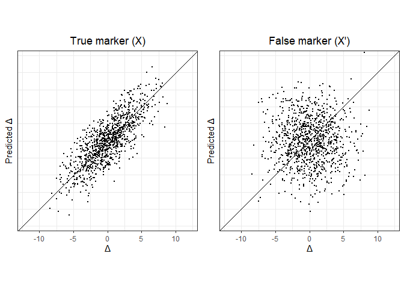

Example 1
================

# Set-up

``` r
library(ggplot2)
library(gridExtra)
library(Cairo) # needed for Greek letters in axis titles
```

``` r
n <- 1000
s_j <- 2
s_delta <- 3
beta <- 1
a <- 1
c_mean <- 50
c_sd <- 10
```

# Generate data

``` r
# simulate chronological age
C <- rnorm(n, mean = c_mean, sd = c_sd)

# X is true marker of biological age, Y is false marker. dev is Delta.
devX <- rnorm(n, mean = 0, sd = s_delta)
devY <- rnorm(n, mean = 0, sd = s_delta)

# simulate biological age
B <- C + devX

# simulate values for X and Y 
X <- beta * (C + devX) + a + rnorm(n, mean = 0, sd = s_j)
Y <- beta * (C + devY) + a + rnorm(n, mean = 0, sd = s_j)
```

# Predict biological age

``` r
# regress CA on X and on Y 
lmX <- lm(C ~ X)
lmY <- lm(C ~ Y)

# obtain fitted values (= predicted biological age)
BpredX <- lmX$fitted.values
BpredY <- lmY$fitted.values
```

# Plots

``` r
# create data frame with all relevant variables 
df_all <- as.data.frame(cbind(C, B, BpredX, BpredY))

plotDeltaT <- ggplot(df_all) + 
        geom_point(aes(x = B - C, y = BpredX - C), size = 0.5) +
        theme_bw()+
        labs (x = "\u0394", y = "Predicted \u0394", title = "True marker (X)") +
        coord_fixed(xlim = c(-12,12), ylim = c(-12,12)) +
        geom_abline(slope = 1)+
        theme(plot.title = element_text(hjust = 0.5), 
              axis.text.y=element_blank(),
              axis.ticks.y=element_blank())
plotDeltaF <- ggplot(df_all) + 
        geom_point(aes(x = B - C, y = BpredY - C), size = 0.5) +
        theme_bw()+
        labs (x = "\u0394", y = "Predicted \u0394" , title = "False marker (X')") +
        coord_fixed(xlim = c(-12,12), ylim = c(-12,12)) +
        geom_abline(slope = 1)+
        theme(plot.title = element_text(hjust = 0.5), 
              axis.text.y=element_blank(),
              axis.ticks.y=element_blank())

p_DeltapredDelta <- grid.arrange(plotDeltaT, plotDeltaF, ncol = 2)
```

<!-- -->

``` r
ggsave(p_DeltapredDelta, filename = "DeltapredDelta.pdf", device = cairo_pdf, 
       path = "img", width = 7, height = 3.5)

plotCXT <- ggplot(df_all) + 
        geom_point(aes(x = C, y = X), size = 0.5) +
        theme_bw()+
        labs (x = "Chronological age", y = "Marker value", title = "True marker (X)") +
        coord_fixed(xlim = c(15,85), ylim = c(15,85)) +
        geom_abline(slope = 1) +
        theme(plot.title = element_text(hjust = 0.5), 
              axis.text.y=element_blank(),
              axis.ticks.y=element_blank())
plotCXF <- ggplot(df_all) + 
        geom_point(aes(x = C, y = Y), size = 0.5) +
        theme_bw()+
        labs (x = "Chronological age", y = "Marker value", title = "False marker (X')") +
        coord_fixed(xlim = c(15,85), ylim = c(15,85)) +
        geom_abline(slope = 1)+
        theme(plot.title = element_text(hjust = 0.5), 
              axis.text.y=element_blank(),
              axis.ticks.y=element_blank())

p_CpredX <- grid.arrange(plotCXT, plotCXF, ncol = 2)
```

<!-- -->

``` r
ggsave(p_CpredX, filename = "CpredX.pdf", device = cairo_pdf, 
       path = "img", width = 7, height = 3.5)
```
