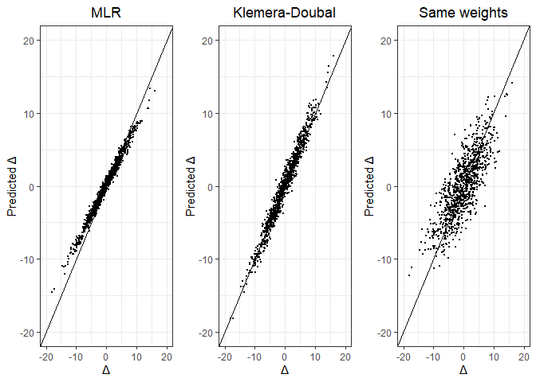
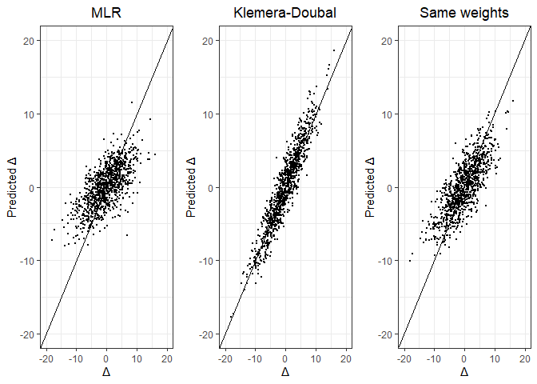
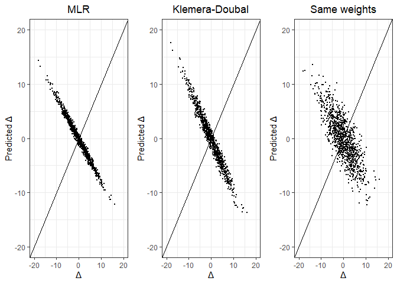
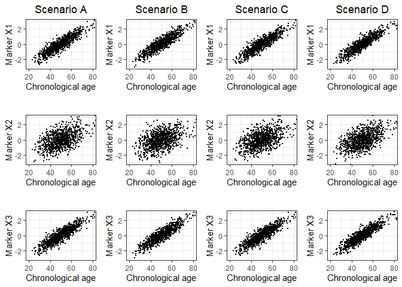

Example 2
================

# Set-up

``` r
source("helper_functions/GetKDestimates.R")
source("helper_functions/GenerateSyntheticData.R")

library(ggplot2)
library(gridExtra)
library(Cairo) # needed for Greek letters in axis titles
library(gtable)
library(grid)
```

``` r
n <- 1000
mean_c <- 50
sd_c <- 10
s_delta <- 5 
vars <- 3
```

# Generate data

``` r
# set seed for reproducibility
myseed = 22 

set.seed(myseed)
xtrue <- GenerateSyntheticData(n, mean_c, sd_c, s_delta, 
                          beta_c = c(10, 3, 5), 
                          beta_delta = c(10, 3, 5), 
                          beta_lambda = c(0, 10, 0), 
                          s_j = c(5, 5, 5))
set.seed(myseed)
xfalse <- GenerateSyntheticData(n, mean_c, sd_c, s_delta, 
                          beta_c = c(10, 3, 5), 
                          beta_delta = c(0, 10, -1), 
                          beta_lambda = c(10, 3, sqrt(24)), 
                          s_j = c(5, 5, 5))
set.seed(myseed)
xhalf <- GenerateSyntheticData(n, mean_c, sd_c, s_delta, 
                          beta_c = c(10, 3, 5), 
                          beta_delta = c(9, 5, 5), 
                          beta_lambda = c(sqrt(100-81), sqrt(109-25), 0), 
                          s_j = c(5, 5, 5))

set.seed(myseed)
xanti <- GenerateSyntheticData(n, mean_c, sd_c, s_delta, 
                          beta_c = c(10, 3, 5), 
                          beta_delta = c(-10, -3, -5), 
                          beta_lambda = c(0, 10, 0), 
                          s_j = c(5, 5, 5))
```

# Obtain biological age estimates: xfalse

Identical-association assumption does not hold (scenario C).

``` r
# define which synthetic data set to use 
df_est <- xfalse

# define for convenience's sake
df_vars <- as.data.frame(scale(df_est[,1:vars])) # normalized (scaled and centered)
c <- df_est$c
b <- df_est$b

# Klemera-Doubal
b_kd <- GetKDestimates(df_vars = df_vars, c = c)[,1]

# MLR
fit_mlr <- lm(c ~ ., data = df_vars)
b_mlr <- fit_mlr$fitted.values

# equal weights
b_ew <- rowSums(mean(abs(fit_mlr$coefficients[-1]) * sign(fit_mlr$coefficients[-1])) * df_vars) + fit_mlr$coefficients[1]
```

## Plot

``` r
# create data frame with all relevant variables 
df_all <- as.data.frame(cbind(c, b, b_kd, b_mlr, b_ew))

# obtain predicted Delta
df_all$delta_mlr <- lm(b_mlr ~ c, data = df_all)$residuals
df_all$delta_ew <- lm(b_ew ~ c, data = df_all)$residuals
df_all$delta_kd <- b_kd - c

# plot Delta against predicted Delta
p_delta_mlr <- ggplot(df_all) + 
        geom_point(aes(x = b-c, y = delta_mlr), size = 0.5) +
        theme_bw()+
        labs (x = "\u0394", y = "Predicted \u0394", title = "MLR") +
        coord_cartesian(xlim = c(-20, 20), ylim = c(-20, 20)) +
        geom_abline(slope = 1)+
        theme(plot.title = element_text(hjust = 0.5))
p_delta_kd <- ggplot(df_all) + 
        geom_point(aes(x = b-c, y = delta_kd), size = 0.5) +
        theme_bw()+
        labs (x = "\u0394", y = "Predicted \u0394" , title = "Klemera-Doubal")+
        coord_cartesian(xlim = c(-20, 20), ylim = c(-20, 20)) +
        geom_abline(slope = 1)+
        theme(plot.title = element_text(hjust = 0.5))
p_delta_ew <- ggplot(df_all) + 
        geom_point(aes(x = b-c, y = delta_ew), size = 0.5) +
        theme_bw()+
        labs (x = "\u0394", y = "Predicted \u0394" , title = "Same weights") +
        coord_cartesian(xlim = c(-20, 20), ylim = c(-20, 20)) +
        geom_abline(slope = 1)+
        theme(plot.title = element_text(hjust = 0.5))

p_delta_all <- grid.arrange(p_delta_mlr, p_delta_kd, p_delta_ew, ncol = 3)
```

<!-- -->

``` r
ggsave(p_delta_all, filename = "xfalse-DeltapredDelta.pdf", device = cairo_pdf, 
       path = "img", width = 7, height = 3.5)
```

# Obtain biological age estimates: xtrue

Identical-assocation assumption holds (scenario A).

``` r
# define which synthetic data set to use 
df_est <- xtrue

# define for convenience's sake
df_vars <- as.data.frame(scale(df_est[,1:vars])) # normalized (scaled and centered)
c <- df_est$c
b <- df_est$b

# Klemera-Doubal
b_kd <- GetKDestimates(df_vars = df_vars, c = c)[,1]

# MLR
fit_mlr <- lm(c ~ ., data = df_vars)
b_mlr <- fit_mlr$fitted.values

# equal weights
b_ew <- rowSums(mean(abs(fit_mlr$coefficients[-1]) * sign(fit_mlr$coefficients[-1])) * df_vars) + fit_mlr$coefficients[1]
```

## Plot

``` r
# create data frame with all relevant variables 
df_all <- as.data.frame(cbind(c, b, b_kd, b_mlr, b_ew))

# obtain predicted Delta
df_all$delta_mlr <- lm(b_mlr ~ c, data = df_all)$residuals
df_all$delta_ew <- lm(b_ew ~ c, data = df_all)$residuals
df_all$delta_kd <- b_kd - c

# plot Delta against predicted Delta
p_delta_mlr <- ggplot(df_all) + 
        geom_point(aes(x = b-c, y = delta_mlr), size = 0.5) +
        theme_bw()+
        labs (x = "\u0394", y = "Predicted \u0394", title = "MLR") +
        coord_cartesian(xlim = c(-20, 20), ylim = c(-20, 20)) +
        geom_abline(slope = 1)+
        theme(plot.title = element_text(hjust = 0.5))
p_delta_kd <- ggplot(df_all) + 
        geom_point(aes(x = b-c, y = delta_kd), size = 0.5) +
        theme_bw()+
        labs (x = "\u0394", y = "Predicted \u0394" , title = "Klemera-Doubal")+
        coord_cartesian(xlim = c(-20, 20), ylim = c(-20, 20)) +
        geom_abline(slope = 1)+
        theme(plot.title = element_text(hjust = 0.5))
p_delta_ew <- ggplot(df_all) + 
        geom_point(aes(x = b-c, y = delta_ew), size = 0.5) +
        theme_bw()+
        labs (x = "\u0394", y = "Predicted \u0394" , title = "Same weights") +
        coord_cartesian(xlim = c(-20, 20), ylim = c(-20, 20)) +
        geom_abline(slope = 1)+
        theme(plot.title = element_text(hjust = 0.5))

p_delta_all <- grid.arrange(p_delta_mlr, p_delta_kd, p_delta_ew, ncol = 3)
```

<!-- -->

``` r
ggsave(p_delta_all, filename = "xtrue-DeltapredDelta.pdf", device = cairo_pdf, 
       path = "img", width = 7, height = 3.5)
```

# Obtain biological age estimates: xhalf

Identical-association assumption partially holds (scenario D).

``` r
# define which synthetic data set to use 
df_est <- xhalf

# define for convenience's sake
df_vars <- as.data.frame(scale(df_est[,1:vars])) # normalized (scaled and centered)
c <- df_est$c
b <- df_est$b

# Klemera-Doubal
b_kd <- GetKDestimates(df_vars = df_vars, c = c)[,1]

# MLR
fit_mlr <- lm(c ~ ., data = df_vars)
b_mlr <- fit_mlr$fitted.values

# equal weights
b_ew <- rowSums(mean(abs(fit_mlr$coefficients[-1]) * sign(fit_mlr$coefficients[-1])) * df_vars) + fit_mlr$coefficients[1]
```

## Plot

``` r
# create data frame with all relevant variables 
df_all <- as.data.frame(cbind(c, b, b_kd, b_mlr, b_ew))

# obtain predicted Delta
df_all$delta_mlr <- lm(b_mlr ~ c, data = df_all)$residuals
df_all$delta_ew <- lm(b_ew ~ c, data = df_all)$residuals
df_all$delta_kd <- b_kd - c

# plot Delta against predicted Delta
p_delta_mlr <- ggplot(df_all) + 
        geom_point(aes(x = b-c, y = delta_mlr), size = 0.5) +
        theme_bw()+
        labs (x = "\u0394", y = "Predicted \u0394", title = "MLR") +
        coord_cartesian(xlim = c(-20, 20), ylim = c(-20, 20)) +
        geom_abline(slope = 1)+
        theme(plot.title = element_text(hjust = 0.5))
p_delta_kd <- ggplot(df_all) + 
        geom_point(aes(x = b-c, y = delta_kd), size = 0.5) +
        theme_bw()+
        labs (x = "\u0394", y = "Predicted \u0394" , title = "Klemera-Doubal")+
        coord_cartesian(xlim = c(-20, 20), ylim = c(-20, 20)) +
        geom_abline(slope = 1)+
        theme(plot.title = element_text(hjust = 0.5))
p_delta_ew <- ggplot(df_all) + 
        geom_point(aes(x = b-c, y = delta_ew), size = 0.5) +
        theme_bw()+
        labs (x = "\u0394", y = "Predicted \u0394" , title = "Same weights") +
        coord_cartesian(xlim = c(-20, 20), ylim = c(-20, 20)) +
        geom_abline(slope = 1)+
        theme(plot.title = element_text(hjust = 0.5))

p_delta_all <- grid.arrange(p_delta_mlr, p_delta_kd, p_delta_ew, ncol = 3)
```

<!-- -->

``` r
ggsave(p_delta_all, filename = "xhalf-DeltapredDelta.pdf", device = cairo_pdf, 
       path = "img", width = 7, height = 3.5)
```

# Obtain biological age estimates: xanti

Identical-association assumption does not hold: reverse association
holds (scenario B).

``` r
# define which synthetic data set to use 
df_est <- xanti

# define for convenience's sake
df_vars <- as.data.frame(scale(df_est[,1:vars])) # normalized (scaled and centered)
c <- df_est$c
b <- df_est$b

# Klemera-Doubal
b_kd <- GetKDestimates(df_vars = df_vars, c = c)[,1]

# MLR
fit_mlr <- lm(c ~ ., data = df_vars)
b_mlr <- fit_mlr$fitted.values

# equal weights
b_ew <- rowSums(mean(abs(fit_mlr$coefficients[-1]) * sign(fit_mlr$coefficients[-1])) * df_vars) + fit_mlr$coefficients[1]
```

## Plot

``` r
# create data frame with all relevant variables 
df_all <- as.data.frame(cbind(c, b, b_kd, b_mlr, b_ew))

# obtain predicted Delta
df_all$delta_mlr <- lm(b_mlr ~ c, data = df_all)$residuals
df_all$delta_ew <- lm(b_ew ~ c, data = df_all)$residuals
df_all$delta_kd <- b_kd - c

# plot Delta against predicted Delta
p_delta_mlr <- ggplot(df_all) + 
        geom_point(aes(x = b-c, y = delta_mlr), size = 0.5) +
        theme_bw()+
        labs (x = "\u0394", y = "Predicted \u0394", title = "MLR") +
        coord_cartesian(xlim = c(-20, 20), ylim = c(-20, 20)) +
        geom_abline(slope = 1)+
        theme(plot.title = element_text(hjust = 0.5))
p_delta_kd <- ggplot(df_all) + 
        geom_point(aes(x = b-c, y = delta_kd), size = 0.5) +
        theme_bw()+
        labs (x = "\u0394", y = "Predicted \u0394" , title = "Klemera-Doubal")+
        coord_cartesian(xlim = c(-20, 20), ylim = c(-20, 20)) +
        geom_abline(slope = 1)+
        theme(plot.title = element_text(hjust = 0.5))
p_delta_ew <- ggplot(df_all) + 
        geom_point(aes(x = b-c, y = delta_ew), size = 0.5) +
        theme_bw()+
        labs (x = "\u0394", y = "Predicted \u0394" , title = "Same weights") +
        coord_cartesian(xlim = c(-20, 20), ylim = c(-20, 20)) +
        geom_abline(slope = 1)+
        theme(plot.title = element_text(hjust = 0.5))

p_delta_all <- grid.arrange(p_delta_mlr, p_delta_kd, p_delta_ew, ncol = 3)
```

<!-- -->

``` r
ggsave(p_delta_all, filename = "xanti-DeltapredDelta.pdf", device = cairo_pdf, 
       path = "img", width = 7, height = 3.5)
```

# Illustration that the scenarios cannot be distinguished based on observable data

``` r
p_x1_true <- ggplot(df_all) + 
        geom_point(aes(x = c, y = scale(xtrue$V1)), size = 0.5) +
        theme_bw()+
        labs (x = "Chronological age", y = "Marker X1", title = "Scenario A") +
        coord_cartesian(xlim = c(20, 80), ylim = c(-3,3)) +
        theme(plot.title = element_text(hjust = 0.5))
p_x1_false <- ggplot(df_all) + 
        geom_point(aes(x = c, y = scale(xfalse$V1)), size = 0.5) +
        theme_bw()+
        labs (x = "Chronological age", y = "Marker X1" , title = "Scenario B")+
        coord_cartesian(xlim = c(20, 80), ylim = c(-3,3)) +
        theme(plot.title = element_text(hjust = 0.5))
p_x1_half <- ggplot(df_all) + 
        geom_point(aes(x = c, y = scale(xhalf$V1)), size = 0.5) +
        theme_bw()+
        labs (x = "Chronological age", y = "Marker X1" , title = "Scenario C")+
        coord_cartesian(xlim = c(20, 80), ylim = c(-3,3)) +
        theme(plot.title = element_text(hjust = 0.5))
p_x1_anti <- ggplot(df_all) + 
        geom_point(aes(x = c, y = scale(xanti$V1)), size = 0.5) +
        theme_bw()+
        labs (x = "Chronological age", y = "Marker X1" , title = "Scenario D")+
        coord_cartesian(xlim = c(20, 80), ylim = c(-3,3)) +
        theme(plot.title = element_text(hjust = 0.5))

p_x2_true <- ggplot(df_all) + 
        geom_point(aes(x = c, y = scale(xtrue$V2)), size = 0.5) +
        theme_bw()+
        labs (x = "Chronological age", y = "Marker X2", title = " ") +
        coord_cartesian(xlim = c(20, 80), ylim = c(-3,3)) +
        theme(plot.title = element_text(hjust = 0.5))
p_x2_false <- ggplot(df_all) + 
        geom_point(aes(x = c, y = scale(xfalse$V2)), size = 0.5) +
        theme_bw()+
        labs (x = "Chronological age", y = "Marker X2" , title = " ")+
        coord_cartesian(xlim = c(20, 80), ylim = c(-3,3)) +
        theme(plot.title = element_text(hjust = 0.5))
p_x2_half <- ggplot(df_all) + 
        geom_point(aes(x = c, y = scale(xhalf$V2)), size = 0.5) +
        theme_bw()+
        labs (x = "Chronological age", y = "Marker X2" , title = " ")+
        coord_cartesian(xlim = c(20, 80), ylim = c(-3,3)) +
        theme(plot.title = element_text(hjust = 0.5))
p_x2_anti <- ggplot(df_all) + 
        geom_point(aes(x = c, y = scale(xanti$V2)), size = 0.5) +
        theme_bw()+
        labs (x = "Chronological age", y = "Marker X2" , title = " ")+
        coord_cartesian(xlim = c(20, 80), ylim = c(-3,3)) +
        theme(plot.title = element_text(hjust = 0.5))

p_x3_true <- ggplot(df_all) + 
        geom_point(aes(x = c, y = scale(xtrue$V3)), size = 0.5) +
        theme_bw()+
        labs (x = "Chronological age", y = "Marker X3", title = " ") +
        coord_cartesian(xlim = c(20, 80), ylim = c(-3,3)) +
        theme(plot.title = element_text(hjust = 0.5))
p_x3_false <- ggplot(df_all) + 
        geom_point(aes(x = c, y = scale(xfalse$V3)), size = 0.5) +
        theme_bw()+
        labs (x = "Chronological age", y = "Marker X3" , title = " ")+
        coord_cartesian(xlim = c(20, 80), ylim = c(-3,3)) +
        theme(plot.title = element_text(hjust = 0.5))
p_x3_half <- ggplot(df_all) + 
        geom_point(aes(x = c, y = scale(xhalf$V3)), size = 0.5) +
        theme_bw()+
        labs (x = "Chronological age", y = "Marker X3" , title = " ")+
        coord_cartesian(xlim = c(20, 80), ylim = c(-3,3)) +
        theme(plot.title = element_text(hjust = 0.5))
p_x3_anti <- ggplot(df_all) + 
        geom_point(aes(x = c, y = scale(xanti$V3)), size = 0.5) +
        theme_bw()+
        labs (x = "Chronological age", y = "Marker X3" , title = " ")+
        coord_cartesian(xlim = c(20, 80), ylim = c(-3,3)) +
        theme(plot.title = element_text(hjust = 0.5))

p_x_all <- grid.arrange(p_x1_true, p_x1_false, p_x1_half, p_x1_anti,
                        p_x2_true, p_x2_false, p_x2_half, p_x2_anti,
                        p_x3_true, p_x3_false, p_x3_half, p_x3_anti,
                        ncol = 4)
```

<!-- -->

``` r
ggsave(p_x_all, filename = "Xall.pdf", device = cairo_pdf, 
       path = "img", width = 8, height = 10)
```
